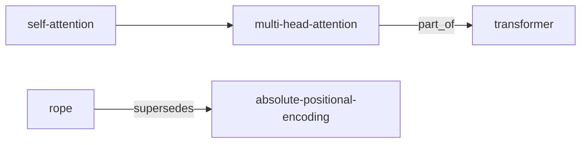

# Agent: Wiki Compiler — Production Specification

Single source of truth for the local AI data-processing agent that compiles `raw/` into `wiki/` and `outputs/`.
Architectural lineage: Karpathy's LLM Wiki — immutable raw layer, LLM-maintained derivatives, entity-first markdown, progressive summarization, link-as-relationship.

Read alongside [`CLAUDE.md`](CLAUDE.md). `CLAUDE.md` defines **content schema**. This file defines the **engineering pipeline** that produces and maintains it.

- **Version:** 1.0.0
- **Owner:** agent (autonomous), human-in-the-loop required only at the Triage gate of Ingest
- **Status:** production
- **Idempotency contract:** running any stage twice on the same input yields the same output (modulo timestamps in `log.md`)

---

## 1. Mission

Transform an unstructured corpus in `raw/` into a queryable knowledge system consisting of:

1. **Canonical markdown** in `wiki/` — one page per concept, entity, source, or comparison.
2. **Knowledge graph** — derived from `[[wikilinks]]` and frontmatter `related` fields, materialized as `outputs/graph.json` and `outputs/graph.mmd`.
3. **Analytics surface** — `outputs/dashboard.html` (BI-style) and `outputs/report-YYYY-MM-DD.md` (prose).
4. **Operational memory** — `wiki/log.md`, `.cache/`, and `outputs/metrics.jsonl` for incremental, observable runs.
5. 
## 2. Non-Goals

- No vector DB. No embeddings index. Search is markdown-native (grep + LLM read).
- No external services beyond the LLM. The pipeline runs locally against the file tree.
- No mutation of `raw/`. Ever. The raw layer is the verification baseline.
- No multi-user concurrency. Single-writer model. Use git for collaboration.

---

## 3. Directory Architecture

```
.
├── CLAUDE.md                          # content schema (read first)
├── agent.md                           # this file — pipeline spec
├── .gitignore
├── .cache/                            # content-addressed cache (gitignored)
│   ├── fingerprints.json              # sha256 → {path, mtime, last_ingested}
│   ├── extracts/<sha256>.json         # normalized extraction per source
│   ├── summaries/<sha256>.{capsule,brief,deep}.md
│   ├── entities/<sha256>.json         # NER output per source
│   └── embeddings/                    # reserved; unused in v1
├── raw/                               # IMMUTABLE inputs
│   ├── articles/                      # web clippings, blog posts (.md, .html)
│   ├── papers/                        # academic PDFs (.pdf, .md)
│   ├── repos/                         # cloned code (read-only subtrees)
│   ├── data/                          # csv/json/parquet datasets
│   ├── images/                        # png/jpg/svg referenced by sources
│   └── assets/                        # everything else
├── wiki/                              # canonical, LLM-maintained markdown
│   ├── index.md                       # master catalog
│   ├── log.md                         # append-only ops log
│   ├── overview.md                    # domain summary
│   ├── concepts/<kebab>.md
│   ├── entities/<kebab>.md
│   ├── sources/<source-slug>.md
│   ├── comparisons/<a>-vs-<b>.md
│   └── topics/<topic-slug>.md         # cluster pages (one per topic)
└── outputs/                           # generated, regenerable, dated
    ├── dashboard.html                 # single-file BI dashboard
    ├── dashboard-data.json            # embedded data, also written out
    ├── report-YYYY-MM-DD.md           # written report
    ├── graph.json                     # adjacency list of wiki KG
    ├── graph.mmd                      # Mermaid render of graph
    ├── timeline.json                  # chronological index
    ├── metrics.jsonl                  # one event per line, structured
    └── lint-YYYY-MM-DD.md             # lint results
```

`.cache/` is the durable computational substrate. `outputs/` is regenerable derivative. `wiki/` is the system of record for knowledge.

## 4. Lifecycle States

Every artifact in the system carries one of seven states. State is stored in frontmatter on wiki pages and in `.cache/fingerprints.json` for raw sources.

```
discovered  → file detected in raw/, not yet fingerprinted
triaged     → fingerprinted, human approved ingest
extracted   → text + structure pulled into .cache/extracts/
summarized  → all three summary tiers exist in .cache/summaries/
linked      → wiki pages created, [[wikilinks]] established
published   → page is in wiki/, indexed, lint-clean
archived    → superseded; kept for history, excluded from active reports
```

Forward transitions only. To revert, archive and re-create.

## 5. File Naming Conventions

| Artifact | Pattern | Example |
|---|---|---|
| Raw source | preserved from origin | `raw/articles/attention-is-all-you-need.pdf` |
| Source slug | `<kebab-title>` (deterministic from title or filename) | `attention-is-all-you-need` |
| Source summary | `wiki/sources/<source-slug>.md` | `wiki/sources/attention-is-all-you-need.md` |
| Concept page | `wiki/concepts/<kebab-concept>.md` | `wiki/concepts/self-attention.md` |
| Entity page | `wiki/entities/<kebab-name>.md` | `wiki/entities/google-brain.md` |
| Comparison | `wiki/comparisons/<a>-vs-<b>.md` (alphabetical) | `wiki/comparisons/rag-vs-fine-tuning.md` |
| Topic | `wiki/topics/<kebab-topic>.md` | `wiki/topics/sequence-modeling.md` |
| Report | `outputs/report-YYYY-MM-DD[-vN].md` | `outputs/report-2026-05-13-v2.md` |
| Cache key | `sha256(content)` truncated to 16 hex chars | `a3f1c2e8b7d04591` |

Slugging rules: lowercase, ASCII fold, non-alphanumeric → `-`, collapse runs, trim. Acronyms preserved (`rag`, not `r-a-g`). Disambiguators in parens dropped (`attention-mechanism`, not `attention-mechanism-nlp`); disambiguation lives in frontmatter `aliases:` instead.

## 6. Metadata Standards

### 6.1 YAML frontmatter — universal fields

```yaml
---
title: Self-Attention
type: concept                    # concept | entity | source-summary | comparison | topic
slug: self-attention
aliases:                         # optional, for disambiguation
  - scaled-dot-product-attention
sources:                         # required for source-summary; recommended elsewhere
  - raw/papers/attention-is-all-you-need.pdf
related:
  - "[[multi-head-attention]]"
  - "[[transformer-architecture]]"
topics:                          # cluster memberships
  - "[[topics/sequence-modeling]]"
created: 2026-05-13
updated: 2026-05-13
confidence: high                 # high | medium | low
quality_score: 87                # 0-100, see §15
state: published
hash: a3f1c2e8b7d04591           # sha256(canonical body), truncated
review_due: 2026-08-13           # optional, ISO date
---
```

### 6.2 Type-specific extensions

`source-summary` adds:
```yaml
source_kind: paper               # paper | article | repo | dataset | book | talk | other
source_url: https://...
source_authors: [Vaswani, et al.]
source_date: 2017-06-12
ingested_at: 2026-05-13T14:22:00Z
```

`entity` adds:
```yaml
entity_kind: organization        # person | organization | product | model | place | event | other
canonical_name: Google Brain
disambiguated_from:              # optional
  - google-deepmind
```

`comparison` adds:
```yaml
left: "[[rag]]"
right: "[[fine-tuning]]"
dimensions: [latency, cost, freshness, governance]
```

`topic` adds:
```yaml
member_count: 14
cohesion: 0.82                   # 0-1, see §10
```

### 6.3 JSON schemas

**`.cache/fingerprints.json`** — registry of every raw file ever seen.
```json
{
  "version": 1,
  "files": {
    "raw/papers/attention-is-all-you-need.pdf": {
      "sha256": "a3f1c2e8...",
      "size_bytes": 2148734,
      "mtime": "2026-05-10T09:14:22Z",
      "first_seen": "2026-05-11T08:00:00Z",
      "last_ingested": "2026-05-13T14:22:00Z",
      "state": "published",
      "source_slug": "attention-is-all-you-need"
    }
  }
}
```

**`.cache/extracts/<sha256>.json`** — normalized extraction.
```json
{
  "sha256": "a3f1c2e8...",
  "source_path": "raw/papers/attention-is-all-you-need.pdf",
  "source_kind": "paper",
  "extracted_at": "2026-05-13T14:22:00Z",
  "extractor_version": "1.0.0",
  "title": "Attention Is All You Need",
  "authors": ["Ashish Vaswani", "Noam Shazeer"],
  "date": "2017-06-12",
  "language": "en",
  "word_count": 8214,
  "sections": [
    {"heading": "Abstract", "text": "..."},
    {"heading": "1 Introduction", "text": "..."}
  ],
  "tables": [{"id": "t1", "caption": "...", "rows": [[...]]}],
  "figures": [{"id": "f1", "caption": "...", "path": "raw/images/..."}],
  "references": [{"raw": "...", "doi": "..."}]
}
```

**`.cache/entities/<sha256>.json`** — NER + linking output.
```json
{
  "sha256": "a3f1c2e8...",
  "entities": [
    {
      "surface": "Google Brain",
      "kind": "organization",
      "canonical": "google-brain",
      "wiki_page": "wiki/entities/google-brain.md",
      "confidence": 0.94,
      "spans": [{"section": "Acknowledgments", "char": 142}]
    }
  ],
  "concepts": [
    {"surface": "scaled dot-product attention", "canonical": "self-attention", "confidence": 0.91}
  ]
}
```

**`outputs/graph.json`** — knowledge graph adjacency.
```json
{
  "version": 1,
  "generated_at": "2026-05-13T14:22:00Z",
  "nodes": [
    {"id": "self-attention", "type": "concept", "weight": 12, "quality": 87}
  ],
  "edges": [
    {"source": "self-attention", "target": "multi-head-attention", "kind": "related", "weight": 1}
  ]
}
```

**`outputs/metrics.jsonl`** — one observability event per line.
```json
{"ts":"2026-05-13T14:22:00Z","run_id":"r-2026-05-13-0001","stage":"extract","source":"raw/papers/...","duration_ms":4120,"ok":true}
```

---

## 7. Ingestion Pipeline

The pipeline is six stages. Each stage is idempotent, content-addressed, and writes to `.cache/` before touching `wiki/`.

```
┌──────────┐   ┌───────────┐   ┌─────────┐   ┌──────────┐   ┌──────────────┐   ┌────────┐
│ DETECT   │ → │ FINGERPRINT│ → │ TRIAGE  │ → │ EXTRACT  │ → │ NORMALIZE    │ → │ STAGE  │
│ scan raw │   │ sha256+mtime│   │ user OK │   │ → cache  │   │ canonical    │   │ summary│
└──────────┘   └───────────┘   └─────────┘   └──────────┘   │ schema       │   │+entities│
                                                              └──────────────┘   └────────┘
                                                                                      │
                                                                                      ▼
                                                                              ┌───────────────┐
                                                                              │ LINK & PUBLISH│
                                                                              │ wiki pages    │
                                                                              └───────────────┘
```

### 7.1 Detect
- Walk `raw/` recursively.
- Skip hidden files, `.gitkeep`, and anything matching `.gitignore`.
- Output: list of candidate paths.

### 7.2 Fingerprint
- Compute `sha256(file_bytes)`.
- Diff against `.cache/fingerprints.json`. Bucket each file as `new`, `changed`, or `unchanged`.
- For `changed`, archive the prior cache entries (move to `.cache/archive/<sha>/`) before recomputing.
- Update `fingerprints.json` for `new`. Defer state advance until Triage.

### 7.3 Triage (human gate)
- For each `new`/`changed` file, agent presents to user:
  - Detected kind, title (best-effort), size, suggested target slug.
  - One-line preview from first paragraph.
- User responses: `ingest`, `skip`, `archive`, `rename <slug>`.
- Only `ingest` advances to Extract. Triage decisions logged to `wiki/log.md`.

### 7.4 Extract
Dispatched by file extension:

| Extension | Extractor | Notes |
|---|---|---|
| `.md`, `.txt` | passthrough | YAML frontmatter parsed if present |
| `.html` | readability strip → markdown | preserve headings, code, tables |
| `.pdf` | text + table extraction | OCR fallback for image-only PDFs |
| `.csv`, `.tsv` | column inference + sample rows | full table preserved in `extract.tables[0]` |
| `.json`, `.yaml` | parse and store as `extract.data` | |
| `.ipynb` | cells flattened (markdown + code + output text) | |
| code dirs | README + manifest only; do not summarize source | |

Output: `.cache/extracts/<sha>.json` matching §6.3 schema. Never partially write — temp file then atomic rename.

### 7.5 Normalize
Apply canonical schema rules (§8). Output replaces extract in place. Adds:
- Language detection.
- Date parsing to ISO 8601.
- Author list deduplication.
- Section heading normalization (sentence case).

### 7.6 Stage
- Generate three-tier summaries (§12) → `.cache/summaries/<sha>.{capsule,brief,deep}.md`.
- Run NER + entity linking → `.cache/entities/<sha>.json`.
- Compute quality score (§15) over the extract.
- State → `summarized`.

The pipeline halts here until `Link & Publish` is invoked. This lets the agent stage many sources, then link them in one cross-cutting pass.

---

## 8. Schema Normalization

Every extract is normalized to this canonical structure before staging:

| Field | Required | Source | Normalization |
|---|---|---|---|
| `title` | yes | extractor | trim, smart-quote fold, title case unless source preserves casing |
| `authors` | when applicable | extractor | array of strings, `Last, First` form, dedupe |
| `date` | when applicable | extractor | ISO 8601; if only year, use `YYYY-01-01` and set `date_precision: year` |
| `source_kind` | yes | classifier | enum from §6.2 |
| `language` | yes | detector | ISO 639-1 |
| `sections` | yes | extractor | array of `{heading, text}`; heading is sentence case |
| `references` | optional | extractor | normalize to `{raw, doi, url}` where possible |

Dates with only `month YYYY` resolve to `YYYY-MM-01` with `date_precision: month`. Missing dates become `null` and the page's `confidence` drops one tier.

---

## 9. Entity Extraction & Relationship Mapping

### 9.1 Extraction
- Run NER over the normalized extract via the LLM, prompted with the entity-kind enum.
- Output candidates: `{surface, kind, span, confidence}`.

### 9.2 Resolution
Each candidate is resolved to a canonical entity through this cascade:

1. **Alias match** — exact match against `aliases:` in existing `wiki/entities/*.md`.
2. **Slug match** — slugified surface equals an existing entity slug.
3. **Fuzzy match** — Jaro-Winkler ≥ 0.92 against canonical names, gated by `kind` agreement.
4. **New entity** — none of the above; create `wiki/entities/<slug>.md` from the entity template.

When step 3 fires, the agent records both the matched and the surface form in `aliases:` for next time.

### 9.3 Relationship kinds

Encoded in frontmatter `related:` and in `outputs/graph.json` `edges[].kind`:

| Kind | Meaning | Example |
|---|---|---|
| `related` | generic association | `[[transformer]]` ↔ `[[self-attention]]` |
| `part_of` | composition | `[[multi-head-attention]]` part_of `[[transformer]]` |
| `instance_of` | typing | `[[gpt-4]]` instance_of `[[large-language-model]]` |
| `contradicts` | mutually inconsistent | flagged during lint |
| `supersedes` | this replaces that | `[[rope]]` supersedes `[[absolute-positional-encoding]]` |
| `cites` | source citation | source page → concept |
| `member_of` | topic membership | concept → topic |

Default kind when unspecified is `related`. Specialized kinds require explicit agent decision and are logged.

### 9.4 Graph materialization
On each Build, the agent walks every wiki page, parses `related:` and inline `[[wikilinks]]`, and writes `outputs/graph.json` (§6.3) plus `outputs/graph.mmd`:



Edge weight = count of distinct link occurrences across both pages.

---

## 10. Topic Clustering

Embeddings are out of scope in v1. Clustering is **lexical-structural + LLM consolidation**:

1. **Co-occurrence graph** — for every pair of concept pages, count shared `[[wikilinks]]` and shared sources.
2. **Greedy modularity** — partition into communities using a simple greedy modularity sweep over the co-occurrence graph.
3. **LLM naming pass** — for each community, agent reads the member titles and proposes a topic name + one-sentence definition.
4. **Threshold** — communities with fewer than 4 members are not promoted to topic pages; their members are tagged as `topics: []` and surfaced in the report under "Unclustered."
5. **Cohesion score** — `cohesion = average pairwise jaccard of related[] sets`, range 0–1, stored in topic frontmatter.

Topic pages live in `wiki/topics/` and act as soft indexes. They are regenerated on Build, not maintained by hand.

---

## 11. Deduplication

Three layers, applied in order:

1. **Byte-exact** — same sha256 → drop, log as duplicate.
2. **Title-fuzzy** — Jaro-Winkler ≥ 0.95 on normalized title AND same `source_kind` AND `date` within 30 days → flag for human merge during Triage.
3. **Semantic-by-overlap** — for staged extracts, compute Jaccard over the top-30 noun phrases. ≥ 0.75 → suggest merging the source-summary pages, keep both raw files.

Duplicate decisions are recorded in `wiki/log.md` with both source slugs. The losing page is archived (frontmatter `state: archived`), never deleted, and gains a frontmatter `superseded_by: "[[slug]]"`.

---

## 12. Progressive Summarization

Every source produces three summary tiers, cached and reused:

| Tier | Target length | Audience | Lives in |
|---|---|---|---|
| `capsule` | 30–60 words | Index rows, dashboard tooltips | `.cache/summaries/<sha>.capsule.md`, embedded in `wiki/sources/*.md` frontmatter as `capsule:` |
| `brief` | 200–300 words | Source page body | `.cache/summaries/<sha>.brief.md`, becomes "## Summary" section |
| `deep` | 1200–1800 words | Researcher diving in | `.cache/summaries/<sha>.deep.md`, becomes "## Deep Dive" section in the source page |

Rules:
- Each tier cites concrete sections of the extract (`§ Abstract`, `§ 3.2`).
- The `brief` must be derivable from the `deep`; the `capsule` from the `brief`. If a higher tier changes, lower tiers are regenerated.
- No tier may introduce facts absent from the extract. The agent verifies by spot-checking 3 random claims per tier against the extract; failed verifications drop the page's confidence one tier.

---

## 13. Markdown Generation

### 13.1 Source-summary template

```markdown
---
title: {{title}}
type: source-summary
slug: {{slug}}
sources:
  - {{raw_path}}
source_kind: {{kind}}
source_url: {{url}}
source_authors: {{authors}}
source_date: {{date}}
ingested_at: {{ingested_at}}
related: []
topics: []
created: {{today}}
updated: {{today}}
confidence: {{confidence}}
quality_score: {{quality}}
state: published
hash: {{hash}}
capsule: |
  {{capsule_text}}
---

# {{title}}

> {{capsule_text}}

## Summary

{{brief_text}}

## Deep Dive

{{deep_text}}

## Key Entities

{{entity_bulleted_list with [[wikilinks]]}}

## Key Concepts

{{concept_bulleted_list with [[wikilinks]]}}

## Notable Claims

- [§{{section}}] {{claim}}  →  evidence: `{{raw_path}}#{{anchor}}`

## Open Questions

- {{question}}
```

### 13.2 Concept template

```markdown
---
title: {{Concept}}
type: concept
slug: {{slug}}
aliases: [{{alias1}}, {{alias2}}]
sources:
  - {{raw_path_1}}
  - {{raw_path_2}}
related:
  - "[[{{related_1}}]]"
topics:
  - "[[topics/{{topic}}]]"
created: {{first_seen}}
updated: {{today}}
confidence: {{level}}
quality_score: {{score}}
state: published
hash: {{hash}}
---

# {{Concept}}

**One-liner:** {{thirty_word_definition}}

## What it is

{{200-400 words synthesizing across cited sources, each claim citing [[source-slug]]}}

## How it works

{{mechanics, with examples; cite sources}}

## Where it shows up

- In [[other-concept-1]] as {{role}}
- In [[other-concept-2]] as {{role}}

## Open debates

- {{debate}}  ([[source-a]] argues X; [[source-b]] argues Y)

## See also

- [[related-1]]
- [[related-2]]
```

### 13.3 Entity template

```markdown
---
title: {{Name}}
type: entity
slug: {{slug}}
entity_kind: {{kind}}
canonical_name: {{Name}}
aliases: [{{alias}}]
related: []
topics: []
created: {{today}}
updated: {{today}}
confidence: {{level}}
quality_score: {{score}}
state: published
hash: {{hash}}
---

# {{Name}}

**Kind:** {{kind}}
**Also known as:** {{aliases joined}}

## Profile

{{2-3 sentence neutral description}}

## Appears in

| Source | Role | Date |
|---|---|---|
| [[source-slug-1]] | {{role}} | {{date}} |

## Related entities

- [[entity-2]] — {{relationship description}}
```

### 13.4 Comparison template

```markdown
---
title: {{A}} vs {{B}}
type: comparison
slug: {{a-slug}}-vs-{{b-slug}}
left: "[[{{a-slug}}]]"
right: "[[{{b-slug}}]]"
dimensions: [{{d1}}, {{d2}}, {{d3}}]
sources: [...]
related: []
created: {{today}}
updated: {{today}}
confidence: {{level}}
quality_score: {{score}}
state: published
hash: {{hash}}
---

# {{A}} vs {{B}}

## At a glance

| Dimension | [[{{a-slug}}]] | [[{{b-slug}}]] |
|---|---|---|
| {{d1}} | ... | ... |
| {{d2}} | ... | ... |

## When {{A}} wins

- {{point}}  ([[source]])

## When {{B}} wins

- {{point}}  ([[source]])

## When neither is right

- {{escape hatch}}
```

### 13.5 Topic template

```markdown
---
title: {{Topic}}
type: topic
slug: {{slug}}
member_count: {{n}}
cohesion: {{c}}
related: []
created: {{today}}
updated: {{today}}
confidence: medium
state: published
hash: {{hash}}
---

# {{Topic}}

**Members:** {{n}} pages, cohesion {{c}}.

## What this clusters

{{LLM-written 100-word definition}}

## Members

- [[concept-1]] — {{one-line capsule}}
- [[concept-2]] — {{one-line capsule}}

## Seed sources

- [[source-1]]
- [[source-2]]
```

---

## 14. `index.md` Generation

`wiki/index.md` is regenerated at the end of every Build. It is never hand-edited.

```markdown
---
title: Index
type: index
updated: {{today}}
page_count: {{n}}
---

# Wiki Index

_Last regenerated: {{timestamp}}. Pages: {{n}}. Sources ingested: {{s}}._

## By Type

| Type | Count |
|---|---|
| Concepts | {{c}} |
| Entities | {{e}} |
| Sources | {{s}} |
| Comparisons | {{p}} |
| Topics | {{t}} |

## Concepts

- [[concept-1]] — {{capsule}}  ·  conf:{{level}}  ·  Q:{{score}}

## Entities

- [[entity-1]] — {{kind}}  ·  appears in {{n}} sources

## Sources

- [[source-1]] — {{kind}}, {{date}}  ·  {{capsule}}

## Comparisons

- [[a-vs-b]]

## Topics

- [[topics/topic-1]] — {{n}} members, cohesion {{c}}
```

---

## 15. Quality Scoring

Per-page integer in `[0, 100]`. Computed at Stage and refreshed at Build.

| Component | Weight | How |
|---|---|---|
| Source reliability | 25 | paper/talk > article > forum post; configurable in `agent.md` table below |
| Citation density | 20 | `cites_per_100_words = sources_referenced / (word_count/100)`, capped at 5 → scaled to 20 |
| Link density | 15 | outgoing `[[wikilinks]]` per 200 words, capped at 6 → scaled to 15 |
| Recency | 10 | linear decay over 24 months from `source_date` (or `updated` for derived pages) |
| Lint passes | 15 | start at 15, subtract 3 per outstanding lint flag affecting this page |
| Verification | 15 | spot-check pass rate (§12); start at 15, scale by pass rate |

**Source reliability table** (override in `wiki/conventions/sources.md` per domain):

| source_kind | base score |
|---|---|
| paper | 22 |
| book | 20 |
| talk | 18 |
| documentation | 18 |
| article | 14 |
| repo | 16 |
| dataset | 20 |
| other | 10 |

Scores < 50 surface in the report's "needs work" section.

## 16. Confidence Scoring

Coarser than quality. Maps from quality + structural signals:

| Confidence | Rule |
|---|---|
| `high` | quality ≥ 80 AND ≥ 2 independent sources AND zero open lint flags |
| `medium` | quality 50–79 OR exactly 1 source OR 1–2 minor lint flags |
| `low` | quality < 50 OR contradictions present OR no sources OR ≥ 3 lint flags |

Confidence is consumed by the dashboard, by lint, and by downstream queries that may prefer high-confidence subsets.

---

## 17. Dashboard Specification (`outputs/dashboard.html`)

Single-file HTML. Loads `chart.js` from `https://cdn.jsdelivr.net/npm/chart.js` and nothing else. All data embedded inline as a JS literal mirroring `outputs/dashboard-data.json`.

### 17.1 KPIs (header strip)

| KPI | Definition |
|---|---|
| **Pages** | total wiki pages with `state: published` |
| **Sources ingested** | distinct sha256 in fingerprints with state ≥ summarized |
| **Coverage** | sources_ingested / total raw files, as % |
| **Mean quality** | average `quality_score` across published pages |
| **High-confidence share** | pages with `confidence: high` / total, as % |
| **Knowledge graph density** | edges / nodes |
| **Open lint flags** | count of unresolved entries from latest `lint-*.md` |
| **Build freshness** | hours since last successful Build |

### 17.2 Sections (in order)

1. **Header strip** — eight KPI tiles.
2. **Pages by type** — doughnut.
3. **Quality distribution** — histogram, bins of 10.
4. **Confidence stacked bar** — by type.
5. **Activity timeline** — line, ops per day over last 90 days from `log.md`.
6. **Top connected** — bar chart of top 15 nodes by degree centrality.
7. **Health cards** — orphans, stale, un-ingested raw, low-confidence, contradictions. Each expands to a list.
8. **Coverage matrix** — table: rows are `raw/` subfolders, columns are state buckets.
9. **All pages table** — sortable by title / type / quality / confidence / updated. Title links to file via `file://` relative path.
10. **Footer** — generation timestamp, run_id, git commit (if `.git/` present).

### 17.3 Visual rules

- Dark theme. System font stack. No background images.
- Color encoding: confidence high=green, medium=amber, low=red. Type colors stable across charts (use a fixed palette stored in `agent.md` if needed).
- All charts use Chart.js defaults; no plugins.
- Tables are vanilla `<table>` with a 50-line inline sort script. No DataTables.

---

## 18. Report Specification (`outputs/report-YYYY-MM-DD.md`)

Markdown. Cited. Under 2,500 words. Frontmatter:

```yaml
---
title: Wiki Report — YYYY-MM-DD
type: report
created: YYYY-MM-DD
wiki_snapshot_pages: {{n}}
wiki_snapshot_sources: {{s}}
build_run_id: {{run_id}}
---
```

### 18.1 Sections

1. **Executive summary** — one paragraph: scope, scale, headline finding, biggest risk. Plain prose, no bullets.
2. **What changed since last report** — diff against the previous report's snapshot fields. New pages, archived pages, confidence shifts.
3. **Coverage** — coverage matrix (also in dashboard) plus prose interpretation.
4. **What's solid** — high-confidence pages, grouped by type, each as `- [[slug]] — one-line takeaway`.
5. **What's tentative** — medium/low-confidence pages with the specific reason they're flagged.
6. **Contradictions** — `[[page-a]] claims X; [[page-b]] claims Y; evidence: [[source]]`.
7. **Top topics** — top 5 topic pages by member count, with one-paragraph orientation each.
8. **Health** — orphans, stale, un-ingested, duplicates, missing concepts referenced but not created.
9. **Recent activity** — last 20 rows of `log.md` as a table.
10. **Suggested next ingests** — prose paragraph picking 3 candidates from `raw/` with no summary yet, explaining why each fills a gap.

### 18.2 Citation rules

Every non-trivial claim cites either a `[[wikilink]]` or a `raw/` path. Numbers (counts, percentages) are not cited but must match `dashboard-data.json` for that run.

---

## 19. Timeline Indexing

`outputs/timeline.json` is the chronological projection of the wiki:

```json
{
  "events": [
    {"date":"2017-06-12","kind":"source","ref":"[[attention-is-all-you-need]]","title":"Attention Is All You Need"},
    {"date":"2026-05-13","kind":"wiki","op":"published","ref":"[[self-attention]]"}
  ]
}
```

Sources contribute their `source_date`. Wiki pages contribute their `created` and significant `updated` events (state transitions). The report's "What changed" section reads from this file.

The dashboard activity chart is the daily aggregate of these events.

---

## 20. Caching Strategy

- **Content-addressed.** Cache keys are sha256 of inputs. Same input → same cache hit, forever.
- **Layered.** Extract is cached separately from summaries and from entities. A summarization change does not invalidate extracts.
- **Versioned.** `extractor_version`, `summarizer_version`, `ner_version` are stored alongside each cache entry. Bumping a version invalidates the corresponding layer for affected files; lower layers stay.
- **Archive on overwrite.** When a cache entry is replaced, the prior is moved to `.cache/archive/<sha>/<timestamp>/` for one Build cycle, then deleted.
- **Bounded.** `.cache/` is capped at 5 GB by LRU eviction of the archive directory. Live cache entries are never evicted.

---

## 21. Logging Strategy

Two logs, two audiences.

### 21.1 `wiki/log.md` — human, append-only

```
| Date       | Run        | Op       | Target                            | Notes                     |
|------------|------------|----------|-----------------------------------|---------------------------|
| 2026-05-13 | r-...-0001 | ingest   | [[attention-is-all-you-need]]     | new source, paper, en     |
| 2026-05-13 | r-...-0001 | publish  | [[self-attention]]                | quality 87, conf high     |
| 2026-05-13 | r-...-0001 | build    | outputs/dashboard.html, report... | 14 pages, 3 health flags  |
```

One row per externally observable change. Rolled monthly by appending a `## YYYY-MM` header, never by truncation.

### 21.2 `outputs/metrics.jsonl` — machine, structured

One event per line. Every stage emits start and end events:

```json
{"ts":"2026-05-13T14:22:00.123Z","run_id":"r-2026-05-13-0001","stage":"extract","event":"start","input":"raw/papers/attention.pdf"}
{"ts":"2026-05-13T14:22:04.241Z","run_id":"r-2026-05-13-0001","stage":"extract","event":"end","input":"raw/papers/attention.pdf","ok":true,"duration_ms":4118,"output_sha":"a3f1..."}
```

Stages: `detect, fingerprint, triage, extract, normalize, summarize_capsule, summarize_brief, summarize_deep, ner, link, publish, lint, build_dashboard, build_report, build_graph`.

Errors carry `ok: false`, `error.class`, `error.message`, and `error.stack_digest` (first 200 chars of traceback).

---

## 22. Incremental Updates

A Build is incremental by default and full only on demand.

### 22.1 Incremental
1. Fingerprint pass identifies `new`, `changed`, `unchanged`.
2. Only `new`/`changed` advance through Extract → Stage.
3. Link & Publish runs over **all staged pages plus any wiki page whose `related:` references a changed slug** — this is the "blast radius" of the change.
4. Graph, topics, index, dashboard, report, timeline are always regenerated wholesale (they're cheap; they're derived).

### 22.2 Full rebuild
Triggered by:
- User command `build --full`.
- Schema version bump (in this file's header).
- Any `extractor_version`/`summarizer_version` bump.

Full rebuild clears `.cache/extracts/`, `.cache/summaries/`, `.cache/entities/`, then re-runs the pipeline end-to-end. `fingerprints.json` is preserved (it's the input ledger).

### 22.3 Determinism
Given identical raw inputs and identical versions, two Builds produce byte-identical `outputs/graph.json`, `outputs/timeline.json`, `outputs/dashboard-data.json`. The HTML and report differ only by timestamp.

---

## 23. Orchestration Flow

Pseudo-code for a single Build:

```python
def build(mode="incremental"):
    run_id = new_run_id()
    metrics.emit("build", "start", run_id=run_id, mode=mode)

    files = walk("raw/")
    fps = fingerprint_diff(files, ".cache/fingerprints.json")

    if mode == "full":
        invalidate_layers(["extracts","summaries","entities"])
        fps = mark_all_changed(fps)

    for f in fps.new + fps.changed:
        decision = triage(f)  # human gate
        if decision != "ingest": continue
        extract(f)
        normalize(f)
        summarize(f, tiers=["capsule","brief","deep"])
        ner(f)

    blast = compute_blast_radius(fps.changed)
    for page in staged_pages() + blast:
        link_and_publish(page)

    cluster_topics()
    regenerate_index()
    write_graph("outputs/graph.json", "outputs/graph.mmd")
    write_timeline("outputs/timeline.json")
    write_dashboard("outputs/dashboard.html", "outputs/dashboard-data.json")
    write_report(f"outputs/report-{today}.md")
    append_log(run_id, summary())

    metrics.emit("build", "end", run_id=run_id, ok=True)
```

The state machine is simple: stages run in this order, each idempotent. Resuming a partial run picks up at the first stage whose outputs are missing or stale relative to its inputs.

---

## 24. Observability

### 24.1 Counters & gauges (read from `metrics.jsonl`)

| Metric | Type | Source |
|---|---|---|
| `runs_total` | counter | count of `build/start` events |
| `runs_failed` | counter | count of `build/end` with `ok: false` |
| `stage_duration_ms{stage}` | histogram | `event: end` durations |
| `pages_published_total` | counter | publish/end events |
| `sources_ingested_total` | counter | extract/end events with new sha |
| `cache_hits_total{layer}` | counter | extract/summarize/ner skipped due to cache |
| `quality_score_mean` | gauge | recomputed at each build, written to `dashboard-data.json` |
| `confidence_distribution` | gauge | histogram by tier |

### 24.2 Health checks (file-based)
- `outputs/healthcheck.json`, written at every Build:
```json
{
  "ok": true,
  "last_build": "2026-05-13T14:22:00Z",
  "last_build_run_id": "r-2026-05-13-0001",
  "pages": 47,
  "open_lint_flags": 3,
  "stale_pages": 1,
  "schema_version": "1.0.0"
}
```

External monitors poll this file. Any `ok: false` or `last_build` older than the configured threshold (default 7 days) is an alert.

### 24.3 Tracing
Every event in `metrics.jsonl` carries `run_id`. Filtering on `run_id` yields a full trace of one Build. Stage spans can be reconstructed by pairing `start`/`end` events on `(run_id, stage, input)`.

---

## 25. Example Outputs

### 25.1 Source-summary page (excerpt)

```markdown
---
title: Attention Is All You Need
type: source-summary
slug: attention-is-all-you-need
sources:
  - raw/papers/attention-is-all-you-need.pdf
source_kind: paper
source_url: https://arxiv.org/abs/1706.03762
source_authors: [Vaswani, Ashish; Shazeer, Noam; ...]
source_date: 2017-06-12
ingested_at: 2026-05-13T14:22:00Z
related:
  - "[[self-attention]]"
  - "[[multi-head-attention]]"
  - "[[transformer-architecture]]"
topics:
  - "[[topics/sequence-modeling]]"
created: 2026-05-13
updated: 2026-05-13
confidence: high
quality_score: 94
state: published
hash: a3f1c2e8b7d04591
capsule: |
  Introduces the Transformer, a sequence-transduction model relying entirely
  on attention and dispensing with recurrence and convolutions.
---

# Attention Is All You Need

> Introduces the Transformer, a sequence-transduction model relying entirely
> on attention and dispensing with recurrence and convolutions.

## Summary
...
```

### 25.2 Dashboard data shape (excerpt)

```json
{
  "generated_at": "2026-05-13T14:22:00Z",
  "kpis": {
    "pages": 47,
    "sources_ingested": 22,
    "coverage_pct": 78.6,
    "mean_quality": 71.4,
    "high_confidence_share": 0.55,
    "graph_density": 3.2,
    "open_lint_flags": 3,
    "build_freshness_hours": 0
  },
  "pages_by_type": {"concept": 18, "entity": 14, "source-summary": 22, "comparison": 4, "topic": 3},
  "quality_histogram": [{"bin":"60-69","count":7}, {"bin":"70-79","count":12}],
  "top_connected": [{"slug":"transformer-architecture","degree":11}]
}
```

### 25.3 Lint output (excerpt)

```markdown
# Lint Report — 2026-05-13

## Contradictions (1)
- [[rag-vs-fine-tuning]] claims fine-tuning is "always cheaper at scale" while [[fine-tuning-cost-model]] presents a crossover analysis. Evidence: raw/articles/cost-of-fine-tuning.md §4.

## Orphan pages (2)
- [[positional-encoding-variants]] — no incoming [[wikilinks]].
- [[attention-is-all-you-need-v2-rumors]] — no incoming links; low confidence.

## Stale pages (1)
- [[transformer-architecture]] last updated 2026-02-04 (>90d).

## Un-ingested raw (3)
- raw/articles/sparse-attention-2025.md
- raw/papers/flash-attention-3.pdf
- raw/articles/state-space-models-revisited.md

## Missing concepts referenced (1)
- [[rotary-positional-embedding]] referenced by [[transformer-architecture]] but page does not exist.
```

---

## 26. Failure Handling

| Failure | Detection | Behavior |
|---|---|---|
| Extractor exception | stage `end` with `ok:false` | source state stays at `triaged`; logged; surfaced in next report |
| Summarizer hallucination | verification spot-check fails | confidence downgraded one tier; flag in lint |
| Conflicting frontmatter | YAML parse error or schema mismatch | page state stays at `linked`, not advanced to `published`; flagged in report |
| Duplicate sha256 with different paths | fingerprint pass | both paths recorded; canonical path is the first-seen; others logged as `aliased_paths:` |
| Cache corruption | json parse error in cache file | quarantine file to `.cache/quarantine/`; recompute layer for affected sha |
| Triage refused | user says `skip` | source state stays at `triaged`, never advances; ignored by all reports until user re-triages |
| Build interrupted | absent `outputs/healthcheck.json` for current run_id | next Build detects missing healthcheck, resumes from last completed stage per `metrics.jsonl` |
| Empty wiki | published page count = 0 | dashboard/report produced anyway, content explains state; never error |

The agent never deletes content. Archive and supersede, but do not destroy. Recovery is always possible from `raw/` + `.cache/fingerprints.json` + git history.

---

## 27. Versioning of This Spec

Changes to this file are themselves logged. Bump the version at the top:

- **Major** — incompatible schema changes (e.g., renamed frontmatter field). Triggers a full rebuild.
- **Minor** — new optional fields, new stages with safe defaults.
- **Patch** — wording, examples, non-behavioral edits.

The `schema_version` in `outputs/healthcheck.json` matches this file's version.
